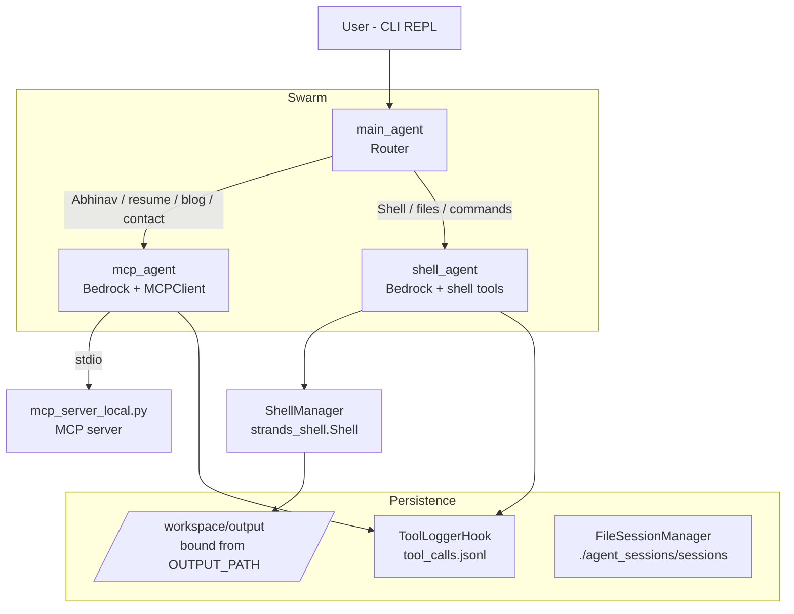

# Abhinav's Personal Website Assistant

**Multi-Agent Swarm · MCP Server · Shell Sandbox**

A multi-agent architecture powering Abhinav Kumar's personal website assistant — capable of answering questions about his background, projects, and blogs, sharing contact details, and executing sandboxed shell operations in a controlled workspace.

---

## Table of Contents

- [Overview](#overview)
- [Tech Stack](#tech-stack)
- [Repository Structure](#repository-structure)
- [Architecture](#architecture)
  - [Architecture Diagram](#architecture-diagram)
  - [Mermaid Diagram](#mermaid-diagram)
- [Agent Roles](#agent-roles)
  - [main_agent — Router](#main_agent--router)
  - [mcp_agent — Website Knowledge Agent](#mcp_agent--website-knowledge-agent)
  - [shell_agent — Sandbox Execution Agent](#shell_agent--sandbox-execution-agent)
- [Shell Sandbox](#shell-sandbox)
- [Steering & Skills](#steering--skills)
- [Tool Logging](#tool-logging)
- [Session Management](#session-management)
- [Swarm Configuration](#swarm-configuration)
- [Getting Started](#getting-started)
  - [Prerequisites](#prerequisites)
  - [Installation](#installation)
  - [Configuration](#configuration)
  - [Running the Assistant](#running-the-assistant)
- [Example Interactions](#example-interactions)
- [Security & Privacy Notes](#security--privacy-notes)
- [Troubleshooting](#troubleshooting)
- [Roadmap Ideas](#roadmap-ideas)
- [Contributing](#contributing)
- [License](#license)

---

## Overview

This project combines several building blocks into a single conversational assistant:

- **Strands Agents** — the agent framework used to define and orchestrate LLM-driven agents
- **MCP (Model Context Protocol) server** — structured, tool-based access to Abhinav's website content (resume, blogs, projects, contact info)
- **Shell sandbox tools** — a constrained, bound shell environment for file and command operations
- **Steering & Skills plugins** — response evaluation/guidance and pluggable extra tools/behaviors
- **Amazon Bedrock LLM models** — the underlying models for each agent
- **A Swarm router** — coordinates handoffs between agents based on user intent
- **Persistent session management** — conversation state saved across turns
- **Tool logging hooks** — an audit trail of every tool call

At a high level: a user types a question into a CLI REPL, a router agent classifies the intent, and hands off to either a **website knowledge agent** (backed by an MCP server) or a **shell execution agent** (backed by a sandboxed shell), each of which is governed by shared steering rules and logging.

## Tech Stack

| Component | Purpose |
|---|---|
| `strands` | Agent framework (Agents, Swarm, Skills, Hooks) |
| `boto3` | AWS SDK, used for Bedrock model access |
| `python-dotenv` | Loads environment variables from `.env` |
| Amazon Bedrock | Hosts the LLMs used by each agent and the steering evaluator |
| MCP (stdio transport) | Exposes Abhinav's website data as callable tools |


## Architecture

### Architecture Diagram

```text
                          +-----------------------------+
                          |        User (CLI REPL)       |
                          +--------------+----------------+
                                         |
                                         v
                          +-----------------------------+
                          |          main_agent           |
                          |   (Router, no tools itself)   |
                          +--------------+----------------+
                                         |
                 +-----------------------+------------------------+
                 |                                                 |
                 v                                                 v
  +-----------------------------+                   +-----------------------------+
  |          mcp_agent            |                   |         shell_agent          |
  |  - BedrockModel (MODEL_ID)    |                   |  - BedrockModel (MODEL_ID)    |
  |  - MCPClient (stdio)          |                   |  - Shell tools:               |
  |  - Skills plugin              |                   |      • sandbox_shell          |
  |  - Steering plugin            |                   |      • sandbox_write          |
  |  - ToolLoggerHook             |                   |      • sandbox_read           |
  +--------------+----------------+                   |      • sandbox_list           |
                 |                                     |  - ToolLoggerHook             |
                 v                                     +--------------+----------------+
  +-----------------------------+                                     |
  |     mcp_server_local.py       |                                     v
  |  (MCP subprocess via stdio)   |                   +-----------------------------+
  |  - Tools: resume/blogs/etc.   |                   |         ShellManager           |
  |  - Reads Abhinav's content    |                   |  - strands_shell.Shell         |
  +-----------------------------+                     |  - Bind:                       |
                                                        |    OUTPUT_PATH ->              |
                                                        |    /workspace/output           |
                                                        +--------------+----------------+
                                                                       |
                                                                       v
                                                        +-----------------------------+
                                                        |     /workspace/output          |
                                                        |  - tool_calls.jsonl            |
                                                        |  - agent_output files          |
                                                        +-----------------------------+

                          +-----------------------------+
                          |      FileSessionManager        |
                          |    ./agent_sessions/sessions    |
                          +-----------------------------+

                          +-----------------------------+
                          |             Swarm               |
                          |    [main, mcp, shell] agents    |
                          |     entry_point: main_agent     |
                          +-----------------------------+
```

### Mermaid Diagram



## Agent Roles

### `main_agent` — Router

**System prompt (conceptual):**
> You are the router for this agent swarm. You have no tools of your own beyond handoff. Questions about Abhinav go to `mcp_agent`. Shell/file operations go to `shell_agent`. Do not answer content questions yourself.

**Responsibilities:**
- Classify user intent
- Hand off to `mcp_agent` or `shell_agent`
- Never directly answer questions itself

### `mcp_agent` — Website Knowledge Agent

**Configured with:**
- `BedrockModel` (`MODEL_ID`, `REGION`)
- `MCPClient` (stdio → `mcp_server_local.py`)
- Skills plugin (`AgentSkills`)
- Steering plugin (`LLMSteeringHandlerWithModelSteering`)
- `ToolLoggerHook`

**System prompt (conceptual):**
> You are Abhinav Kumar's personal website assistant. Visitors may want to contact Abhinav. His PII (phone, email, LinkedIn, GitHub, website) can be shared.

**Responsibilities:**
- Answer questions about Abhinav's background and career
- Surface blog and project details
- Answer resume-related questions
- Share contact information
- Use MCP tools to fetch data, and respect steering rules and the PII disclaimer

### `shell_agent` — Sandbox Execution Agent

**Configured with:**
- `BedrockModel` (`MODEL_ID`, `REGION`)
- Shell tools: `sandbox_shell`, `sandbox_write`, `sandbox_read`, `sandbox_list`
- Skills plugin
- `ToolLoggerHook`

**System prompt (conceptual):**
> You are Abhinav Kumar's personal shell assistant. Your job is to execute tasks using shell tools in his personal workspace shell.

**Responsibilities:**
- Execute shell commands in a sandbox
- Read, write, and list files under `/workspace/output`
- Return command output and file contents

## Shell Sandbox

`ShellManager`:

- Uses `concurrent.futures.ThreadPoolExecutor(max_workers=1)` to serialize shell operations
- Creates a `strands_shell.Shell` bound as:
  - **source:** `OUTPUT_PATH` (local directory)
  - **destination:** `/workspace/output` (sandbox)
  - **mode:** `"direct"`

**Methods:**

| Method | Description |
|---|---|
| `run(command)` | Executes a shell command inside the sandbox |
| `write_file(path, content)` | Writes content to a file |
| `read_file(path)` | Reads a file's contents |
| `list_files(path)` | Lists files in a directory |
| `close()` | Tears down the shell session |

**Exposed shell tools:**

| Tool | Behavior |
|---|---|
| `sandbox_write(path, content)` | Writes content to `/workspace/output/{basename(path)}` |
| `sandbox_shell(command)` | Runs a shell command (e.g. `ls` is mapped to `ls /workspace/output`) |
| `sandbox_read(path)` | Reads `/workspace/output/{basename(path)}` |
| `sandbox_list(path="")` | Lists files in `/workspace/output` |

> **Note:** All shell tool paths are resolved by `basename`, which restricts operations to the bound `/workspace/output` directory rather than the full filesystem.

## Steering & Skills

### Skills

- Loaded via `AgentSkills(skills="./MCP_based-retreival/skills/")`
- Applied to both `mcp_agent` and `shell_agent`
- Provide additional tools/behaviors defined by whatever is placed in the skills directory

### Steering (`LLMSteeringHandlerWithModelSteering`)

Uses a separate Bedrock model (`mistral.mistral-large-2402-v1:0`) as an evaluator over final agent responses.

**Key rules:**

- Never blocks or cancels tool calls — it only evaluates final text output
- Only evaluates responses where `stop_reason == "end_turn"`
- **Tone:** friendly, helpful, cheerful, positive, semi-formal (not overly professional, not overly casual)
- **Specificity:** only use information returned by tools; no assumptions or inferred details; ask for more context if a tool result is insufficient
- **PII handling:** if a resume-reading tool (e.g. `read_resume`) is used and PII is present, the response must include:
  > "The provided personally sensitive information is given with the consent of Abhinav Kumar."
- **File path handling:** file paths are suppressed from user-facing responses

**Decision logic:**

- `"proceed"` — response is compliant, returned as-is
- `"guide"` — response needs revision, actionable feedback is provided back to the agent

## Tool Logging

`ToolLoggerHook`:

- Registered on `AfterToolCallEvent`
- Captures for every tool call:
  - `timestamp` (ISO 8601, UTC)
  - tool name
  - arguments
  - result
  - exception (if any)
- Reads the existing `/workspace/output/tool_calls.jsonl` (if present)
- Appends the new entry and writes back via `shell_mgr.write_file`

**Log file:** `/workspace/output/tool_calls.jsonl` — JSON Lines format (one JSON object per line).

## Session Management

`FileSessionManager`:

- `session_id = "session-{uuid}"`
- `storage_dir = "./agent_sessions/sessions"`
- Used by the `Swarm` to persist conversation/session state across turns

## Swarm Configuration

| Setting | Value |
|---|---|
| Agents | `[main_agent, mcp_agent, shell_agent]` |
| `entry_point` | `main_agent` |
| `max_handoffs` | `10` |
| `max_iterations` | `10` |
| `execution_timeout` | `300.0` seconds |
| `node_timeout` | `120.0` seconds |
| `repetitive_handoff_detection_window` | `6` |
| `repetitive_handoff_min_unique_agents` | `2` |
| `session_manager` | `FileSessionManager` |

**Behavior:**

1. User input enters via `main_agent`
2. The Swarm routes to the appropriate agent based on the router's classification
3. Agents may hand off between each other (bounded by `max_handoffs` / `max_iterations`)
4. The final response is returned to the CLI

## Getting Started

### Prerequisites

- Python 3.10+
- An AWS account with Bedrock access enabled for the models referenced by `MODEL_ID` and the steering model
- AWS credentials configured (e.g. via `aws configure`, environment variables, or an IAM role)

### Installation

```bash
pip install strands boto3 python-dotenv
```

> Adjust package names/versions as pinned in your `requirements.txt`, if one exists.

### Configuration

Create a `.env` file in the project root:

```env
REGION=us-east-1
MODEL_ID=<your-bedrock-model-id>
```

Also confirm the following paths are set correctly before running:

- `SERVER_PATH` → points to `mcp_server_local.py`
- `SHELL_PATH` and `OUTPUT_PATH` → exist on disk and are writable

### Running the Assistant

```bash
python strands-code.py
```

You should see:

```text
Welcome to Abhinav's personal assistant. Type 'exit' to quit.
You:
```

Type `exit` at any time to close the session (this also triggers `shell_mgr.close()`).

## Example Interactions

| User Input | Routed To | Result |
|---|---|---|
| "Tell me about Abhinav's projects." | `mcp_agent` | Fetches project info via MCP tools |
| "How can I contact Abhinav?" | `mcp_agent` | Returns phone / email / LinkedIn / GitHub / website |
| "Run ls" | `shell_agent` | `sandbox_shell` lists files in `/workspace/output` |
| "Read tool_calls.jsonl" | `shell_agent` | `sandbox_read` returns the log file's contents |

## Security & Privacy Notes

- Contact and resume-related tools intentionally expose Abhinav's PII (phone, email, LinkedIn, GitHub, website) with his consent — the steering layer enforces a disclaimer whenever this happens.
- Shell tools are bound to a single sandboxed directory (`/workspace/output`) via `basename`-restricted paths; they are not intended to reach outside that boundary.
- File paths are stripped from user-facing responses by the steering layer to avoid leaking internal filesystem structure.
- Treat `.env` (`REGION`, `MODEL_ID`) and any AWS credentials as secrets — do not commit them to version control.

## Troubleshooting

| Symptom | Likely Cause | Fix |
|---|---|---|
| Assistant hangs on startup | `SERVER_PATH` incorrect or MCP server fails to launch | Verify `mcp_server_local.py` path and that it runs standalone via `python mcp_server_local.py` |
| Bedrock auth errors | Missing/invalid AWS credentials or region mismatch | Check `REGION` in `.env` and confirm Bedrock model access is enabled for your account |
| Shell tools return "file not found" | Path outside the sandbox, or `OUTPUT_PATH` misconfigured | Confirm `OUTPUT_PATH` exists and that the file was written via `sandbox_write` first |
| Repeated handoffs / no final answer | Router misclassifying intent | Review `main_agent` system prompt and `repetitive_handoff_*` settings |
| Missing PII disclaimer | Steering model unavailable or evaluation skipped | Confirm the steering `BedrockModel` (`mistral.mistral-large-2402-v1:0`) is reachable |

## Roadmap Ideas

- [ ] Add automated tests for each agent's routing logic
- [ ] Add a `requirements.txt` / `pyproject.toml` for reproducible installs
- [ ] Support additional MCP tools (e.g. GitHub activity, blog RSS feed sync)
- [ ] Add structured evaluation metrics for the steering layer (tone, PII compliance rate)
- [ ] Containerize the app (Docker) for easier deployment
- [ ] Add a web front-end in addition to the CLI REPL

