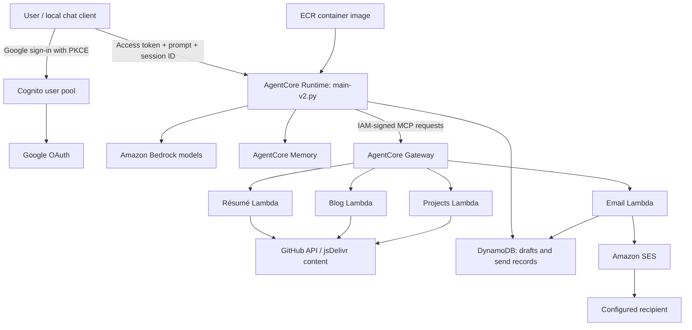

# GitHub Personal Profile Assistant

A reusable conversational assistant for anyone who wants to make their public profile, experience, GitHub projects, and writing accessible through chat, with email contact integrated into the conversation. Built with Amazon Bedrock AgentCore, Strands Agents, and Terraform, it provides a foundation for a personal portfolio assistant, developer profile assistant, or professional contact assistant.

The profile owner supplies GitHub-hosted content and configures their email destination. Visitors can ask about the owner's background, discover projects and repository links, read summaries of published work, and draft or send a message to the owner after signing in.

This repository contains the AWS backend, Lambda deployment packages, containerized agent, and a local terminal chat client. You can connect your own website or chat interface to the deployed runtime; no frontend is bundled here.

## Product capabilities and scope

- **Profile discovery:** answer questions about the owner's experience, skills, r�sum�, and published contact information.
- **Project and repository discovery:** explain projects from GitHub-hosted descriptions and share repository links included in that content.
- **Published content:** list and summarize blog posts and project write-ups using retrieved source material.
- **Conversational contact:** compose drafts and submit messages to the owner's configured email address through Amazon SES, using the signed-in visitor's verified email as reply-to.
- **Conversation continuity:** keep user-scoped facts and session summaries through AgentCore Memory.
- **Self-hosted deployment:** configure your own AWS account, models, content repository, identity provider credentials, and email identities.

The current content tools read a configured public GitHub repository containing r�sum�/profile Markdown, project descriptions, and blog posts. They do not automatically enumerate every repository on a GitHub account, index arbitrary source code, or call the GitHub user-profile API. Include repository links and descriptions in your content, or extend the retrieval Lambdas and Gateway tool schemas for direct account/repository discovery. Email integration currently supports outbound contact through SES; it does not read or synchronize an inbox.

## Adapt the assistant to your profile

The deployment configuration is reusable, but the checked-in agent prompts and skills still contain the original example owner's identity. Complete these steps when deploying for another person:

1. **Prepare your content.** Choose a public GitHub repository and add your r�sum�/profile, project descriptions, and optional blog posts as Markdown with the metadata expected by the retrieval packages. Include links to the repositories you want visitors to discover.
2. **Configure your deployment.** Set the GitHub owner, repository, branch, content paths, AWS image/model settings, Google OAuth credentials, and email identities in `infra/terraform.tfvars` using the template below.
3. **Customize the assistant identity.** Update owner names, profile/contact matching patterns, prompts, agent descriptions, and user-facing messages in `code/agentcore-runtime/main-v2.py`. Review all files under `code/agentcore-runtime/skills/` and the tool descriptions in `infra/agentcore-gateway/`. Some skill directory names include the example owner's name; if renaming them, update their front-matter names and every Python/prompt reference together.
4. **Connect your email destination.** Set `assistant_email` to the SES sender and `recipient_email` to the address where you want to receive visitor messages. Verify the required SES identities. Each deployment currently has one configured recipient.
5. **Build and deploy.** Rebuild the runtime image after personalizing the code/skills, push it to ECR, and apply Terraform. Repackage any Lambda code you change before applying.
6. **Connect a client.** Use the included terminal client or integrate your own frontend with the runtime's authentication and invocation contract. Register any additional frontend callbacks in Cognito.

Changing only `.env` configures the terminal client's connection; it does not personalize the deployed assistant. Changing only Terraform content/email inputs also leaves the existing owner-specific prompts unchanged.

## Architecture


```mermaid
flowchart TD
    User[User / local chat client] -->|Google sign-in with PKCE| Cognito[Cognito user pool]
    Cognito --> Google[Google OAuth]
    User -->|Access token + prompt + session ID| Runtime[AgentCore Runtime: main-v2.py]
    Runtime --> Models[Amazon Bedrock models]
    Runtime --> Memory[AgentCore Memory]
    Runtime -->|IAM-signed MCP requests| Gateway[AgentCore Gateway]
    Gateway --> Resume[Résumé Lambda]
    Gateway --> Blog[Blog Lambda]
    Gateway --> Projects[Projects Lambda]
    Resume --> Content[GitHub API / jsDelivr content]
    Blog --> Content
    Projects --> Content
    Runtime --> MailTable[DynamoDB: drafts and send records]
    Gateway --> Email[Email Lambda]
    Email --> MailTable
    Email --> SES[Amazon SES]
    SES --> Recipient[Configured recipient]
    ECR[ECR container image] --> Runtime
```

1. The client opens Google sign-in through Cognito and exchanges the authorization code using PKCE. Tokens stay in client memory.
2. The client sends the latest prompt and a request ID to the deployed runtime, with the access token and conversation session ID in headers.
3. AgentCore's JWT authorizer checks the token. Application code also validates the JWT signature, issuer, expiry, token type, and Cognito app client. The token subject identifies the user.
4. A main Strands agent coordinates conversation, a profile agent retrieves the configured profile and project content through Gateway tools, and an email agent composes messages. A steering model and hooks check selected response/tool behavior.
5. AgentCore Memory stores conversation events and retrieves user facts and session summaries. DynamoDB stores email drafts and operation records; the email Lambda uses send records to limit duplicate submissions.
6. Email uses the configured SES sender and profile owner�s destination address. The runtime gets the signed-in user's verified email from Cognito UserInfo and supplies it as the reply-to address.

The runtime uses public networking. Its calls to Gateway use AWS IAM authentication; client calls to the runtime use Cognito JWT authentication. IAM roles grant the deployed services their AWS permissions.

## Repository structure

```code
.
├── README.md
├── agentcore_chat.py                 # Local terminal client (actual filename)
├── requirements-chat.txt             # Client: httpx and python-dotenv
├── .env.example                      # Template for local client configuration
├── .env                              # Local client values; ignored by Git
├── infra/                            # Terraform root module
│   ├── terraform.tf                  # Terraform/provider constraints, S3 backend
│   ├── main.tf                       # Module composition and output references
│   ├── variables.tf                  # Required root inputs
│   ├── outputs.tf                    # Runtime and endpoint ARNs
│   ├── terraform.tfvars              # Your deployment values; ignored by Git
│   ├── backend.hcl                   # Your S3 state backend configuration
│   ├── iam/
│   ├── lambda/
│   ├── agentcore-gateway/
│   ├── agentcore-runtime/
│   ├── agentcore-memory/
│   ├── cognito/
│   ├── ses/
│   └── dynamodb/
└── code/
    ├── agentcore.json.bkp             # Backup configuration, not deployment input
    ├── lambda/
    │   ├── lambda_function.py         # Email Lambda source
    │   ├── send_email.zip             # Email Lambda deployment package
    │   ├── send_email-old.zip         # Previous email package
    │   ├── resume_lambda.zip
    │   ├── blog_lambda.zip
    │   └── projects_lambda.zip
    └── agentcore-runtime/
        ├── main-v2.py                 # Agent application and runtime entrypoint
        ├── Dockerfile
        ├── .dockerignore
        ├── requirements.txt           # Agent/container dependencies
        ├── docker-steps.md            # PowerShell build and ECR push workflow
        ├── README.Docker.md           # Additional Docker notes
        └── skills/                   # Résumé, projects, blogs, and email instructions
```

Local configuration files in this tree may need to be created after cloning. Run the commands below from the repository root unless a step changes directories. Examples use PowerShell.

## Prerequisites

| Requirement | Purpose |
| --- | --- |
| Python 3.12 | Matches the container and Lambda runtimes; use a virtual environment for local work. |
| Terraform >= 1.14.0 | Required by `infra/terraform.tf`. |
| AWS provider ~> 6.65.0; template provider 2.2.0 | Declared in Terraform and installed by `terraform init`. |
| AWS CLI and valid AWS credentials | Terraform deployment, ECR authentication, and resource inspection. |
| Docker Desktop / Docker Engine with Buildx | Build the Linux ARM64 runtime image; Docker must be running. |
| AWS account and chosen region | AgentCore, Bedrock model access, Lambda, Cognito, SES, DynamoDB, ECR, and IAM permissions. |
| Existing S3 state bucket | The backend does not create its own bucket. |
| Google OAuth client ID and secret | Configure Google's identity provider in Cognito. |
| Public GitHub profile/project content | The packaged retrieval Lambdas use GitHub and jsDelivr without a configured GitHub token. |
| SES identity verification and DNS access | Verify the sender/domain and publish the domain verification/DKIM records. |

Use models available to your account in `REGION` and `STEERING_REGION`. The deployment identity needs permission to provision the resources and pass their IAM roles. SES sandbox accounts also require verified recipients before sending to them.

Configure an AWS profile using your organization's normal authentication method. For SSO:

```powershell
aws configure sso
$env:AWS_PROFILE = "<profile-name>"
$env:AWS_REGION = "<aws-region>"
$env:AWS_DEFAULT_REGION = $env:AWS_REGION
aws sso login --profile $env:AWS_PROFILE
aws sts get-caller-identity
```

Terraform takes its provider region from the AWS configuration/environment; there is no root Terraform `region` variable. The S3 backend has its own region setting. Do not put AWS credentials in the image or `terraform.tfvars`.

The terminal client itself does **not** require AWS credentials: it authenticates with Google/Cognito. Credentials are needed for provisioning, pushing images, and running the agent application locally against AWS services.

## Terraform infrastructure

### Components

| Module | Resources and responsibility |
| --- | --- |
| `iam` | Execution roles and policies for retrieval Lambdas, email Lambda, Gateway, and Runtime; ECR pull, model inference, memory, Gateway access, logs/tracing, SES, and DynamoDB permissions. |
| `lambda` | Four Python 3.12 functions deployed from ZIPs: `resume-tool-lambda`, `blog-tool-lambda`, `projects-tool-lambda`, and `send-email-lambda`. |
| `agentcore-gateway` | IAM-authorized MCP Gateway with résumé, blog, project, and email Lambda targets and inline tool schemas. |
| `agentcore-runtime` | Container-based runtime, Cognito JWT authorizer, forwarded Authorization header, environment variables, and a version-linked runtime endpoint. |
| `agentcore-memory` | Memory resource with 30-day event expiry, semantic facts, and summarization strategies. |
| `cognito` | User pool, Google identity provider, public app client with authorization-code flow, and hosted login domain. |
| `ses` | Sender email identity, domain identity, and DKIM configuration. DNS records are not created here. |
| `dynamodb` | On-demand `<app_name>-mail` table with string partition key `id`; shared by Runtime and the email Lambda. |

Terraform does not provision the website frontend, Google OAuth application, ECR repository, state bucket, or DNS records. Some resource names are fixed in the modules, so changing `project_name` alone does not fully isolate multiple deployments in the same account/region.

### Directory structure, modularization, and references

`infra/` is the root module. Terraform reads its `.tf` files together; subdirectories run only because `infra/main.tf` declares them as child modules with `source = "./<folder>"`.

Most child modules have `main.tf`, `variables.tf`, and `outputs.tf`. The memory module currently needs no input variables. The Gateway module also defines its tool-schema maps in `variables.tf`.

Configuration flows through three layers:

```hcl
# infra/terraform.tfvars supplies a root variable:
container_uri = "<account-id>.dkr.ecr.<region>.amazonaws.com/agentcore-runtime:<tag>"

# infra/main.tf passes that variable and another module's output:
module "agentcore-runtime" {
  source       = "./agentcore-runtime"
  container_uri = var.container_uri
  runtime_role  = module.iam.runtime_role
  # Other required arguments omitted in this illustration.
}

# Inside the child module, resource configuration reads its own inputs:
# container_uri = var.container_uri
```

`var.<name>` references an input in the current module. `module.<name>.<output>` references a child module's exported value. `data.aws_region.current.region` and `data.aws_caller_identity.current.account_id` discover the deployment region/account. These references establish Terraform's resource dependencies.

For example, Lambda ARNs feed Gateway targets and IAM policies; Gateway URL, Memory ID, Cognito endpoints, and the DynamoDB table name feed the Runtime module. The IAM and service modules exchange references at the resource level; deploy from the root module so Terraform can resolve the complete graph.

### Configure `infra/terraform.tfvars`

All 25 inputs in `infra/variables.tf` are strings without defaults and must be supplied. Create the lowercase filename `terraform.tfvars` inside `infra/`; Terraform loads it automatically when run there or with `-chdir=infra`.

The following template includes every required variable. Replace the placeholders and adapt the example content paths to your profile/content repository:

```hcl
# Naming
project_name = "github-profile-assistant"
app_name     = "<unique-app-name>"
root_domain  = "example.com"

# Lambda artifacts; paths resolve from infra/ for the commands in this README.
blog_zip_path     = "../code/lambda/blog_lambda.zip"
projects_zip_path = "../code/lambda/projects_lambda.zip"
resume_zip_path   = "../code/lambda/resume_lambda.zip"
send_email_path   = "../code/lambda/send_email.zip"

# Profile, projects, and writing: content repository and paths within it
github_owner  = "<github-owner>"
github_repo   = "<profile-content-repository>"
github_branch = "main"
resume_path   = "<path/to/resume.md>"
blog_path     = "<path/to/blog-directory>"
projects_path = "<path/to/projects-directory>"
github_api    = "https://api.github.com"
jsdeliver_base = "https://cdn.jsdelivr.net/gh/<github-owner>/<profile-content-repository>@main"

# Existing ECR repository and pushed image
ecr_arn       = "arn:aws:ecr:<region>:<account-id>:repository/agentcore-runtime"
container_uri = "<account-id>.dkr.ecr.<region>.amazonaws.com/agentcore-runtime:<release-tag>"

# Bedrock model IDs or supported inference-profile identifiers
model_id          = "<main-model-id>"
steering_model_id = "<steering-model-id>"
steering_region   = "<steering-model-region>"

# Google OAuth credentials, NOT the Cognito app client ID
client_id     = "<google-oauth-client-id>"
client_secret = "<google-oauth-client-secret>"

# Email configuration
assistant_email = "assistant@example.com"
recipient_email = "owner@example.com"
website         = "example.com"
```

Important details about these inputs:

- `app_name` determines the Cognito hosted-domain prefix `<app_name>-auth` and the mail table name. Choose an available Cognito domain prefix.
- `root_domain` is passed into the Cognito module but is currently unused by its resources; it does not configure a custom login domain.
- `website` is the bare domain verified by SES, without `https://` or a path. `assistant_email` is the sender; `recipient_email` is the fixed destination.
- `jsdeliver_base` is the exact Terraform variable spelling. Terraform passes it as `JSDELIVR_BASE`, but the current retrieval packages construct the jsDelivr URL from the owner/repository/branch themselves, so changing this input alone does not change their CDN base URL.
- ZIP paths point to existing files. Terraform hashes and uploads them; it does not build them.
- `ecr_arn` is the repository ARN used for pull permissions. `container_uri` is the tagged image URI used to deploy the runtime.

`terraform.tfvars` is Git-ignored. The Google secret is not marked `sensitive` in the current variable declaration and can be present in Terraform state or plan output; keep those artifacts private and control access to the state bucket.

### Backend and deployment

Create or adapt `infra/backend.hcl` for an existing S3 bucket:

```hcl
bucket       = "<existing-state-bucket>"
key          = "github-profile-assistant/terraform.tfstate"
region       = "<state-bucket-region>"
use_lockfile = true
encrypt      = true
```

Use a distinct state key for each deployment. The deployment identity needs access to both the state and its lock file.

After preparing the Lambda ZIPs and pushing the runtime image as described below:

```powershell
terraform -chdir=infra init -backend-config=backend.hcl
terraform -chdir=infra fmt -check -recursive
terraform -chdir=infra validate
terraform -chdir=infra plan -out=tfplan.out
terraform -chdir=infra apply tfplan.out
terraform -chdir=infra output
```

Review the plan before applying it. The current root outputs are `agentcore_runtime` and `agentcore_runtime_endpoint`, both ARNs. Cognito and SES outputs exist in child modules but are not exposed as active root outputs.

For Google OAuth, register `https://<app_name>-auth.auth.<region>.amazoncognito.com/oauth2/idpresponse` as an authorized redirect URI in the Google OAuth application. This is distinct from the client callback. The Cognito module currently hardcodes the client callback to `http://localhost:3000/callback.html` and logout URL to `http://localhost:3000/index.html`. Update that module if adding a deployed website callback.

Complete SES email verification and publish the required domain/DKIM DNS records. Retrieve them from the SES console or inspect the child-module outputs in `terraform -chdir=infra console`, for example `module.ses.ses_dkim_tokens` and `module.ses.ses_domain_verification_token`.

## Application code and Lambda packages

`code/` separates the runtime container from independently deployed Lambda tool packages. The files under `code/agentcore-runtime/skills/` provide agent instructions for résumé retrieval, project content, blog content, and email composition; these are bundled into the image.

### `code/lambda/` and corresponding functions

Every function uses handler `lambda_function.lambda_handler`. Retrieval functions have a 15-second timeout; the email function has a 30-second timeout.

| Package / source | Deployed function | Gateway tools and behavior |
| --- | --- | --- |
| `resume_lambda.zip` | `resume-tool-lambda` | `read_resume`: structured contact/front-matter fields and résumé body. |
| `blog_lambda.zip` | `blog-tool-lambda` | `list_blogs`, `get_first_blog`, `get_last_blog`, `get_latest_blogs`, `get_oldest_blogs`, `read_blog`. Listing tools return metadata; `read_blog` retrieves full article content. |
| `projects_lambda.zip` | `projects-tool-lambda` | `list_projects`, `get_first_project`, `get_last_project`, `get_latest_projects`, `get_oldest_projects`, `read_projects`. Listing tools return metadata; `read_projects` retrieves full content. |
| `send_email.zip`, built from `lambda_function.py` | `send-email-lambda` | `send_email`: validates message fields, records the send attempt in DynamoDB, and submits to SES using the configured sender/recipient. |

The retrieval packages contain their own `lambda_function.py` and PyYAML dependencies. Their source is currently stored inside the ZIPs rather than in separate source directories. They parse Markdown/YAML front matter and retrieve content through GitHub/jsDelivr. Preserve their dependencies and keep the handler at the ZIP root when rebuilding. `send_email-old.zip` is a historical package, not the default artifact shown above.

Terraform supplies retrieval settings as `GITHUB_OWNER`, `GITHUB_REPO`, `GITHUB_BRANCH`, `GITHUB_API`, `JSDELIVR_BASE`, and the appropriate `RESUME_PATH`, `BLOG_PATH`, or `PROJECTS_PATH`.

The email Lambda receives `ASSISTANT_EMAIL`, `MAIL_TABLE_NAME`, and **`RECEIPIENT_EMAIL`**. That misspelling is currently used consistently by Terraform and Python; do not change only one side. Its `reply_to` and `request_id` inputs come from trusted runtime code. An SES message ID confirms submission, not final delivery.

After editing the email source, rebuild its package from the repository root:

```powershell
Compress-Archive -Path code/lambda/lambda_function.py -DestinationPath code/lambda/send_email.zip -Force
```

Then run Terraform plan/apply. `source_code_hash` detects ZIP changes. Editing the Python file without rebuilding the ZIP will not update the Lambda.

## AgentCore runtime and Docker

### How `main-v2.py` integrates with Runtime

`main-v2.py` creates a `BedrockAgentCoreApp`. Its `@app.entrypoint` function `invoke(payload, context)` validates the prompt, authenticated user, session ID, and request ID; builds the memory-backed main agent; and returns the answer. `app.run()` starts the SDK HTTP server, which exposes `/ping` and `/invocations` on port 8080.

The invocation payload has this shape:

```json
{
  "prompt": "Tell me about the profile owner's latest project",
  "request_id": "unique-request-id"
}
```

The session comes from `RequestContext.session_id`, populated from the runtime session header. The actor ID comes from the validated token, not the request body. Session IDs must contain 33–256 letters, digits, underscores, or hyphens; request IDs must contain 1–128 of those characters. Successful responses contain `result` and `session_id`; validation failures return `error`. Transport retries of the same email operation must reuse the same request ID.

The Dockerfile:

1. Starts from `python:3.12-slim` and uses `/app` as its working directory.
2. Installs `code/agentcore-runtime/requirements.txt`.
3. Copies the application and skills into the image; `.dockerignore` excludes `.env`, credentials, virtual environments, and local artifacts.
4. Exposes port 8080 and runs `python main-v2.py`.

Terraform points AgentCore at `container_uri`, supplies its execution role and environment, and creates an endpoint referencing the runtime version. Pushing an image to ECR alone does not update that configuration.

### Runtime environment variables

Terraform injects all of these into the deployed container:

| Variable | Source / purpose |
| --- | --- |
| `REGION` | AWS provider region; main model, Gateway, memory, and mail storage. |
| `MODEL_ID` | `model_id`; main/profile/email model. |
| `STEERING_REGION` | `steering_region`; steering model region. |
| `STEERING_MODEL_ID` | `steering_model_id`; steering model identifier. |
| `GATEWAY_URL` | Gateway module output; IAM-authenticated MCP endpoint. |
| `AGENTCORE_MEMORY_ID` | Memory module output; required by `build_agents()`. |
| `COGNITO_ISSUER_URL` | Cognito issuer; JWT issuer/JWKS validation. |
| `COGNITO_APP_CLIENT_ID` | Cognito app client output; token-client validation. |
| `COGNITO_USERINFO_URL` | Cognito hosted-domain UserInfo endpoint; verified email lookup. |
| `MAIL_TABLE_NAME` | DynamoDB module output; email draft/operation storage. |

Unlike `agentcore_chat.py`, `main-v2.py` does not load `.env` automatically. Local runtime development requires these variables in the process environment (or a Docker `--env-file`) and working AWS credentials/permissions. The root client `.env` does not contain enough settings to run the agent service. Despite an older comment in the file, the current implementation requires AgentCore Memory and has no local file-memory fallback.

For local Python runtime development, use a separate environment:

```powershell
python -m venv code/agentcore-runtime/.venv
code/agentcore-runtime/.venv/Scripts/python.exe -m pip install -r code/agentcore-runtime/requirements.txt
# Supply the runtime environment variables and AWS credentials before starting:
code/agentcore-runtime/.venv/Scripts/python.exe code/agentcore-runtime/main-v2.py
```

The runtime requirements include Boto3/Botocore, Strands Agents and tools, AgentCore's Strands memory integration, MCP, the AWS IAM MCP proxy, HTTPX, and PyJWT with cryptography. Most dependencies are not tightly pinned, so validate a rebuilt image when updating dependencies, particularly the experimental Strands APIs imported by this application.

### Build and push the image to ECR

Follow [the PowerShell Docker workflow](code/agentcore-runtime/docker-steps.md). Its reference to `main.py` is outdated: this repository's Dockerfile starts **`main-v2.py`**. The following commands use the actual build directory.

```powershell
Set-Location code/agentcore-runtime
$ImageName = "agentcore-runtime"
$ImageTag = "<new-release-tag>"
$RepositoryName = "agentcore-runtime"
$AwsRegion = $env:AWS_REGION
$LocalImage = "${ImageName}:${ImageTag}"

docker buildx build --platform linux/arm64 --provenance=false --load -t $LocalImage .
docker image inspect $LocalImage --format '{{.Os}}/{{.Architecture}}'
```

The architecture output should be `linux/arm64`. Use a new tag for each release. If the ECR repository does not exist, create it once:

```powershell
aws ecr create-repository --repository-name $RepositoryName --region $AwsRegion
```

Retrieve the repository details, log in, and push:

```powershell
$RepositoryUri = aws ecr describe-repositories --repository-names $RepositoryName --region $AwsRegion --query 'repositories[0].repositoryUri' --output text
$RepositoryArn = aws ecr describe-repositories --repository-names $RepositoryName --region $AwsRegion --query 'repositories[0].repositoryArn' --output text
$Registry = $RepositoryUri.Split('/')[0]
$ImageUri = "${RepositoryUri}:${ImageTag}"

aws ecr get-login-password --region $AwsRegion | docker login --username AWS --password-stdin $Registry
docker tag $LocalImage $ImageUri
docker push $ImageUri
aws ecr describe-images --repository-name $RepositoryName --image-ids "imageTag=$ImageTag" --region $AwsRegion --query 'imageDetails[0].{Tags:imageTags,Digest:imageDigest}' --output table

$RepositoryArn
$ImageUri
Set-Location ../..
```

Set `ecr_arn` to `$RepositoryArn` and `container_uri` to `$ImageUri` in `infra/terraform.tfvars`, then plan/apply from the repository root. Repeat the build, push, and Terraform update after changing `main-v2.py`, skills, or runtime dependencies.

## Run the local chat client

The file is named **`agentcore_chat.py`** (not `agentcode_chat.py`). It runs locally but invokes the deployed agent; Docker is not needed on a machine used only for chatting.

### Install dependencies and create `.env`

From the repository root:

```powershell
python -m venv .venv
.venv/Scripts/python.exe -m pip install -r requirements-chat.txt
# Only copy when .env does not already exist:
Copy-Item .env.example .env
```

Edit `.env` beside `agentcore_chat.py`:

```dotenv
AGENT_RUNTIME_ARN=arn:aws:bedrock-agentcore:<region>:<account-id>:runtime/<runtime-id>
AGENT_RUNTIME_ENDPOINT_ARN=arn:aws:bedrock-agentcore:<region>:<account-id>:runtime/<runtime-id>/runtime-endpoint/<endpoint-name>
COGNITO_DOMAIN=https://<app-name>-auth.auth.<region>.amazoncognito.com
COGNITO_APP_CLIENT_ID=<cognito-app-client-id>
COGNITO_CALLBACK_URL=http://localhost:3000/callback.html
# Optional explicit endpoint override:
# AGENT_ENDPOINT_QUALIFIER=DEFAULT
```

| Variable | Required? | How to obtain it |
| --- | --- | --- |
| `AGENT_RUNTIME_ARN` | Yes | `terraform -chdir=infra output -raw agentcore_runtime`. Use the runtime ARN, not the endpoint ARN. |
| `AGENT_RUNTIME_ENDPOINT_ARN` | Optional | `terraform -chdir=infra output -raw agentcore_runtime_endpoint`. The client extracts the trailing endpoint name. |
| `AGENT_ENDPOINT_QUALIFIER` | Optional | Overrides the extracted endpoint name. If neither endpoint setting is supplied, the client invokes `DEFAULT`. |
| `COGNITO_DOMAIN` | Yes | Hosted login domain from `app_name` and deployment region; HTTPS origin without a path. |
| `COGNITO_APP_CLIENT_ID` | Yes | Cognito console, or evaluate `module.cognito.app_client_id` in `terraform -chdir=infra console`. This is not the Google OAuth client ID. |
| `COGNITO_CALLBACK_URL` | Yes | Exact URL registered in Cognito; the current Terraform value is shown above. |

The client always loads `.env` relative to its own file, regardless of your working directory. Precedence is **command-line argument > existing environment variable > `.env`**. The runtime region is extracted from its ARN. No Google client secret, AWS keys, or access token is needed in this file.

### Sign in and chat

```powershell
.venv/Scripts/python.exe agentcore_chat.py
```

The client opens the browser and starts a temporary localhost callback listener on port 3000. Complete Google sign-in and return to the terminal. No separate web server or physical `callback.html` file is needed. Port 3000 must be free, and the callback must match Cognito's configuration.

Enter a message at `You:`. Type `exit` or `quit` to finish. The printed session ID can be reused after signing in again:

```powershell
.venv/Scripts/python.exe agentcore_chat.py --session-id "<previous-session-id>"
```

The same authenticated user and session ID resume that user's conversation context. Tokens remain in memory and are not automatically refreshed; rerun the client after expiry.

Available overrides are `--cognito-client-id`, `--cognito-domain`, `--callback-url`, `--agent-runtime-arn`, `--qualifier`, and `--session-id`. Use `--help` for details. Example:

```powershell
.venv/Scripts/python.exe agentcore_chat.py --qualifier DEFAULT
```

## Troubleshooting

| Symptom | Check |
| --- | --- |
| Missing client configuration | Fill the root `.env`; confirm an existing shell environment variable is not overriding it. |
| Browser login or redirect fails | Distinguish Google's `/oauth2/idpresponse` redirect from Cognito's localhost callback; check both registrations and the two different client IDs. |
| Callback port cannot bind | Close the process using port 3000, or register and configure another allowed localhost callback. |
| Runtime returns 401/403 | Sign in again; check the runtime authorizer's Cognito client/issuer, runtime ARN, and endpoint qualifier. |
| Old runtime behavior after image push | Use a new image tag, update `container_uri`, and apply Terraform. |
| Lambda edits have no effect | Rebuild the configured ZIP and apply Terraform. |
| Profile content cannot be retrieved | Check GitHub owner/repository/branch/paths, public access, and GitHub rate limits. |
| Email cannot be sent | Check verified Cognito email, SES sender/recipient status, regional SES settings, IAM permissions, and DynamoDB access. Avoid blindly resending an operation whose submission status is unknown. |
| Agent fails during local startup | Supply all runtime variables and AWS credentials; installing dependencies alone does not configure the AWS services. |

Use CloudWatch logs for deployed Runtime/Lambda diagnostics. Keep `.env`, Terraform variable files, state, plans, tokens, and credentials out of commits and container images.
